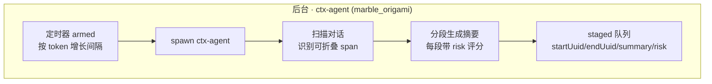

## 尝试解决的问题

想起来之前做的 learn-pi-agent 里面的 compaction 比较粗糙：
1. 判定当前上下文达到阈值
2. 从后往前找到安全切点（在两个turn之间 && 切点后的消息长度>keepToken)
3. 分隔消息为 toSummarise 和 Kept 两部分
4. 检查 toSummarize 中是否已有摘要信息，若有则保留摘要，其余部分序列化为纯文本
5. 将纯文本组装为 compaction prompt 发给 llm
6. 构造 CompactionSummaryMessage=\[compactionSummaryMsg, ...kept]
7. 重复步骤1，若仍然溢出则重复步骤

所以我准备按 lcc->pi->pi-memory/qmd 的顺序把 context compact 和 memory 都整理一遍，不过 memory 的部分可能有点长，放在另一个 til 里面整理。

---

## 正文

### lcc : 2 layers , 4 mechanisms

lcc 中通过一个 0api 层和一个  1api 层构建了上下文压缩机制，下图比较清晰的展示了压缩管线：

<div style="text-align: center;">
    
    <div style="font-size: 0.85em; color: #888; margin-top: 5px;">图 1：brief claude code context compact workflow</div>
</div>

四种压缩机制分别为：

- L3 : 长 tool result 通过文件存储，不保持在上下文中
- L1 : 裁剪 messages 数组，仅保留首尾若干条消息
- L2 : 清理旧 tool result，只保留最近几条
- L4 : 调用 api 总结旧消息，将旧消息通过文件存储，messages 数组中只保留压缩结果

> 其中 L4 有两种触发方式，一种为前三层压缩后仍然超过阈值，另一种为通过 /compact 主动触发

### Claude Code sourse code

lcc 中的深入 cc 部分不是很清晰，所以从 [chauncygu/collection-claude-code-source-code: 🔥 A collection of the Claude Code open source](https://github.com/chauncygu/collection-claude-code-source-code) 里 clone 了反编译的源码，方便日后查看。

CC 的完整压缩管线如下：
 ```mermaid
   flowchart TD
       IN([query 循环]) --> B[applyToolResultBudget]
       B --> S[snipCompact]
       S --> M[microCompact]
       M --> D{contextCollapse 启用?}
       D -->|是| CL[applyCollapsesIfNeeded]
       D -->|否| AC[autoCompact]
       CL --> API[API 调用]
       AC --> API
       API -->|正常| OUT([下一轮])
       API -->|413| R[recoverFromOverflow]
       R -->|成功| API
       R -->|无可排空| RC[reactiveCompact]
       RC -->|成功| API
       RC -->|失败| ERR([异常上抛])
 ```

其中 `contextCollapse` 和 `post-compact restore` 在 lcc 中没有提及。

#### contextCollapse: no yield compaction

contextCollapse 似乎是 CC 的一个测试方案，其设计理念为：折叠视图，而不是直接动 REPL 数组

要理解他的设计方案，得先弄清楚 CC 的三层 messages 数组：
- 磁盘 transcript：原始记录，append-only 只增不删
- 内存 REPL 数组：会话进行中的消息列表
- messagesForQuery：真正发给 api 的视图

之前的 microCompact、snipCompact、autoCompact 都是直接动 REPL 的，而 contextCollapse 提供了一个仅折叠，不删改的方案。

为了理解它的架构，先介绍一下它的组件：

- ctx-agent：后台执行的 subagent，代号 marble_origami，负责生成摘要
- 摘要：结构为{startUuid, endUuid, summary, risk, stagedAt}，其中 risk 分数表示折叠后丢信息的风险
- staged 队列：暂存摘要
- commit log：已提交的折叠
- projectView：投影函数，将 messagesForQuery 中的被折叠部分替换为摘要

其流程图如下：

 ```mermaid
   flowchart TD

       subgraph FG["前台 · 每轮阈值阶梯"]
           U{上下文水位?}
           U -->|< 90%| IDLE[仅累积 staged<br/>不动历史]
           U -->|>= 90% commit| AP[applyCollapsesIfNeeded<br/>staged → committed]
           AP --> LOG[commit log 追加<br/>collapseId + span 边界 + summaryContent]
           U -->|>= 95% blocking| BLK[阻塞主循环<br/>等 ctx-agent 完成 commit]
           BLK --> LOG
       end

       subgraph VIEW["视图投影"]
           PV[projectView<br/>重放 commit log] --> REPLACE[归档 span → &lt;collapsed id&gt; 占位符]
           REPLACE --> SEND[投影视图发给 API<br/>原始历史仍在 REPL]
       end

       subgraph REC["应急恢复 · 413"]
           R1[recoverFromOverflow<br/>staged 全部强制 commit]
           R1 -->|committed > 0| RETRY[重试 API<br/>reason=collapse_drain_retry]
           R1 -->|无可排空| R2[reactiveCompact<br/>保尾 5 条 + LLM 摘要]
           R2 -->|成功| RETRY
           R2 -->|失败| ERR[异常上抛]
       end

       subgraph PERSIST["持久化"]
           WRITE[commit + snapshot 写入 transcript]
           RESUME[/resume → restoreFromEntries<br/>重建 commit log 与视图/]
           CLEAR[compact 边界 → 清空 commit log<br/>折叠体系重新开始]
       end

       LOG --> PV
       SEND --> API{API 调用}
       API -->|正常| NEXT[继续下一轮]
       API -->|413| R1
       LOG --> WRITE --> RESUME
       WRITE --> CLEAR
 ```



