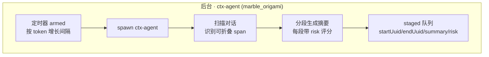

## 尝试解决的问题

想起来之前做的 learn-pi-agent 里面的 compaction ：
1. 判定当前上下文达到阈值
2. 从后往前找到安全切点（在两个turn之间 && 切点后的消息长度>keepToken)
3. 分隔消息为 toSummarise 和 Kept 两部分
4. 检查 toSummarize 中是否已有摘要信息，若有则保留摘要，其余部分序列化为纯文本
5. 将纯文本组装为 compaction prompt 发给 llm
6. 构造 CompactionSummaryMessage=\[compactionSummaryMsg, ...kept]
7. 重复步骤1，若仍然溢出则重复步骤

所以我准备按 lcc->pi->pi-memory/qmd 的顺序把 context compact 和 memory 都整理一遍，不过 memory 的部分可能有点长，放在另一个 til 里面整理。

---

## 正文

### lcc : 2 layers , 4 mechanisms

lcc 中通过一个 0api 层和一个  1api 层构建了上下文压缩机制，下图比较清晰的展示了压缩管线：

<div style="text-align: center;">
    
    <div style="font-size: 0.85em; color: #888; margin-top: 5px;">图 1：brief claude code context compact workflow</div>
</div>

四种压缩机制分别为：

- L3 : 长 tool result 通过文件存储，不保持在上下文中
- L1 : 裁剪 messages 数组，仅保留首尾若干条消息
- L2 : 清理旧 tool result，只保留最近几条
- L4 : 调用 api 总结旧消息，将旧消息通过文件存储，messages 数组中只保留压缩结果

> 其中 L4 有两种触发方式，一种为前三层压缩后仍然超过阈值，另一种为通过 /compact 主动触发

### Claude Code sourse code

lcc 中的深入 cc 部分不是很清晰，所以从 [chauncygu/collection-claude-code-source-code: 🔥 A collection of the Claude Code open source](https://github.com/chauncygu/collection-claude-code-source-code) 里 clone 了反编译的源码，方便日后查看。

CC 的完整压缩管线如下：
 ```mermaid
   flowchart TD
       IN([query 循环]) --> B[applyToolResultBudget]
       B --> S[snipCompact]
       S --> M[microCompact]
       M --> D{contextCollapse 启用?}
       D -->|是| CL[applyCollapsesIfNeeded]
       D -->|否| AC[autoCompact]
       CL --> API[API 调用]
       AC --> API
       API -->|正常| OUT([下一轮])
       API -->|413| R[recoverFromOverflow]
       R -->|成功| API
       R -->|无可排空| RC[reactiveCompact]
       RC -->|成功| API
       RC -->|失败| ERR([异常上抛])
 ```

其中 `contextCollapse` 和 `post-compact restore` 在 lcc 中没有提及。

#### contextCollapse: no yield compaction

contextCollapse 似乎是 CC 的一个测试方案，其设计理念为：折叠视图，而不是直接动 REPL 数组

要理解他的设计方案，得先弄清楚 CC 的三层 messages 数组：
- 磁盘 transcript：原始记录，append-only 只增不删
- 内存 REPL 数组：会话进行中的消息列表
- messagesForQuery：真正发给 api 的视图

之前的 microCompact、snipCompact、autoCompact 都是直接动 REPL 的，而 contextCollapse 提供了一个仅折叠，不删改的方案。

为了理解它的架构，先介绍一下它的组件：

- ctx-agent：后台执行的 subagent，代号 marble_origami，负责生成摘要
- 摘要：结构为{startUuid, endUuid, summary, risk, stagedAt}，其中 risk 分数表示折叠后丢信息的风险
- staged 队列：暂存摘要
- commit log：已提交的折叠
- projectView：投影函数，将 messagesForQuery 中的被折叠部分替换为摘要

其流程图如下：

 ```mermaid
   flowchart TD

       subgraph FG["前台 · 每轮阈值阶梯"]
           U{上下文水位?}
           U -->|< 90%| IDLE[仅累积 staged<br/>不动历史]
           U -->|>= 90% commit| AP[applyCollapsesIfNeeded<br/>staged → committed]
           AP --> LOG[commit log 追加<br/>collapseId + span 边界 + summaryContent]
           U -->|>= 95% blocking| BLK[阻塞主循环<br/>等 ctx-agent 完成 commit]
           BLK --> LOG
       end

       subgraph VIEW["视图投影"]
           PV[projectView<br/>重放 commit log] --> REPLACE[归档 span → &lt;collapsed id&gt; 占位符]
           REPLACE --> SEND[投影视图发给 API<br/>原始历史仍在 REPL]
       end

       subgraph REC["应急恢复 · 413"]
           R1[recoverFromOverflow<br/>staged 全部强制 commit]
           R1 -->|committed > 0| RETRY[重试 API<br/>reason=collapse_drain_retry]
           R1 -->|无可排空| R2[reactiveCompact<br/>保尾 5 条 + LLM 摘要]
           R2 -->|成功| RETRY
           R2 -->|失败| ERR[异常上抛]
       end

       subgraph PERSIST["持久化"]
           WRITE[commit + snapshot 写入 transcript]
           RESUME[/resume → restoreFromEntries<br/>重建 commit log 与视图/]
           CLEAR[compact 边界 → 清空 commit log<br/>折叠体系重新开始]
       end

       LOG --> PV
       SEND --> API{API 调用}
       API -->|正常| NEXT[继续下一轮]
       API -->|413| R1
       LOG --> WRITE --> RESUME
       WRITE --> CLEAR
 ```




#### post-compact restore

由于 l4 compact 将整个消息数组替换为一个摘要，模型可能丢失了有关当前工作文件、下一步计划的上下文，所以要塞一些东西回去，这就是 `post-compact restore`。

它恢复的内容主要分为 `messagesToKeep` 和 `attachments`，其中后者包括以下内容：
1. 文件：从 readFileState 恢复最近读取的文件缓存
2. skill：重新注入最近调用的 skill 主体
3. plan：当前会话的 plan 文件
4. 异步 agent ：后台子 agent 的状态

除此之外，messagesToKeep 针对的是 partial compact ，这似乎是 v2.1.88 给未来部分压缩预留的接口，实际上没有 UI 入口调用它。但是这并不是说部分压缩不存在，reactiveCompact 和 sessionMemoryCompact 都是保留尾部，对早期历史做摘要，但是他们都不通过 `partialCompactConversation(pivot)` 调用。

恢复后的消息顺序：`[boundary 标记] → [summary] → [messagesToKeep] → [attachments] → [hook 结果]`

boundary 实际上是 compact_boundary 类型信息，resume 时从它开始重建，其结构如下：

 ```typescript
   {
     type: 'system',
     subtype: 'compact_boundary',
     content: 'Conversation compacted',          // 给人看的固定文案
     isMeta: false,
     timestamp: ISO 字符串,
     uuid: randomUUID(),
     level: 'info',

     compactMetadata: {
       // ① 必填
       trigger: 'manual' | 'auto',               // 谁触发的压缩

       // ② 必填:压缩前的 token 数(记录水位)
       preTokens: number,

       // ③ 压缩时从参数带进来的(可选)
       userContext?: string,                     // 用户上下文快照
       messagesSummarized?: number,              // 被总结掉的消息条数

       // ④ 压缩后发现的已加载延迟工具(compact.ts:605-611 动态附加)
       preCompactDiscoveredTools?: string[],     // 压缩前已加载的 deferred tool 名
                                                 // (摘要不保留 tool_reference 块,
                                                 //  靠这个字段在压缩后继续发送
                                                 //  已加载的工具 schema)

       // ⑤ 有 messagesToKeep 时,annotateBoundaryWithPreservedSegment 附加
       preservedSegment?: {
         headUuid: UUID,     // 保留段起点
         anchorUuid: UUID,   // 段前面接谁(summary 或 boundary 自身)
         tailUuid: UUID,     // 保留段终点
       },
     },

     // ⑥ 可选:逻辑父节点(创建时传 lastPreCompactMessageUuid)
     logicalParentUuid?: UUID,

     // ⑦ 仅 HISTORY_SNIP 实验启用时,在 boundary 子类型上加(applySnipRemovals 消费)
     snipMetadata?: { removedUuids: UUID[] },    // 被 snip 删除的消息 uuid
   }
 ```

#### several ques 

 问题 1： 一个会话里模型连续读了 30 个大文件,上下文迅速膨胀,API 直接返回了 413(prompt_too_long)。请按顺序描述:从下一次重试开始,CC 会依次走哪些路径?每一步是否调用 LLM(API 成本多少)?走到哪一步为止?（提示:区分"每轮调用前的预处理"和"413 之后的恢复链"。）

 问题 2：contextCollapse 启用时,autocompact 被显式压制(shouldAutoCompact 直接 return false)。但 reactiveCompact 和手动 /compact 不受影响。请解释:

 1. 为什么 collapse 和 autocompact 不能共存?(提示:两个阈值各自是多少,为什么"赛跑"会坏事)
 2. 为什么偏偏 reactiveCompact 和 /compact 要保留?如果它们也被压制会出什么问题?（提示：两个原因不相同）

 问题 3：一个会话压缩了两次(两次都有 messagesToKeep),然后你 /resume 恢复会话。请问:

 3. 两次压缩的 preservedSegment 都会恢复吗?为什么?
 4. 恢复后的消息链中,preserved 段的消息在磁盘上的 parentUuid 指向哪里?为什么不能直接改磁盘?
 5. head→anchor 和 anchor 的其他子→tail 这两步 relink 分别修补什么?(提示: anchor 即 summary) 


### pi original

其实 learn-pi-agent/main 下的整理的已经挺好了，感觉实际流程图跟当时做的版本差不太多。

 ```mermaid
   flowchart TD
       subgraph TRIG["触发检测 · 每轮 assistant 消息完成后"]
           A[_checkCompaction] --> B{compaction enabled?}
           B -->|否| EXIT1([跳过])
           B -->|是| C{消息来自<br/>压缩边界之前?}
           C -->|是| EXIT1
           C -->|否| D{isContextOverflow?}
           D -->|是| E{willRetry<br/>stopReason ≠ stop?}
           E -->|否| F[_runAutoCompaction<br/>reason=overflow<br/>willRetry=false]
           E -->|是| G{_overflowRecoveryAttempted?}
           G -->|是| ERR([报错: 一次重试后仍溢出,停止])
           G -->|否| H[标记 attempted<br/>从 agent state 删除错误消息<br/>历史保留]
           H --> I[_runAutoCompaction<br/>reason=overflow<br/>willRetry=true]
           D -->|否| J{contextTokens ><br/>contextWindow - 16384?}
           J -->|是| K[_runAutoCompaction<br/>reason=threshold]
           J -->|否| EXIT2([继续正常流程])
       end

       subgraph RUN["压缩执行 · _runAutoCompaction"]
           L[反向扫描累积 token<br/>直到 keepRecentTokens=20000] --> M{找到切割点}
           M -->|正常 turn 边界| N[提取 messagesToSummarize<br/>从上次 firstKeptEntryId 起]
           M -->|split turn<br/>单 turn 超预算| O[turnPrefixMessages<br/>历史摘要 + 前缀摘要合并]
           N --> P{extension 拦截?<br/>session_before_compact}
           O --> P
           P -->|cancel| EXIT3([取消])
           P -->|自定义摘要| Q[用扩展摘要<br/>直接落盘]
           P -->|默认| R[serializeConversation<br/>tool result 截断 2000 字符]
           R --> S[LLM 生成结构化摘要<br/>previousSummary 迭代]
           S --> Q
       end

       subgraph STORE["落盘 · 重载"]
           T[append CompactionEntry<br/>summary + firstKeptEntryId<br/>tokensBefore + details]
           T --> U[会话重载<br/>发给 LLM = 摘要 + firstKeptEntryId 之后的消息]
           U --> V{willRetry?}
           V -->|是| W[重试被中断的 turn]
           V -->|否| EXIT4([完成])
       end

       F --> RUN
       I --> RUN
       K --> RUN
       Q --> STORE
 ```

不过注意到 pi 自己在设计的时候有两个比较关键的 commit ，包含了竞品调研和设计路线选择理由，两个 desc 做了翻译：[[pi-compaction-design-zh]]/[[pi-undercompaction-analysis-zh]]

## To be continued

接下来的部分参考[[memory？memory！]]

